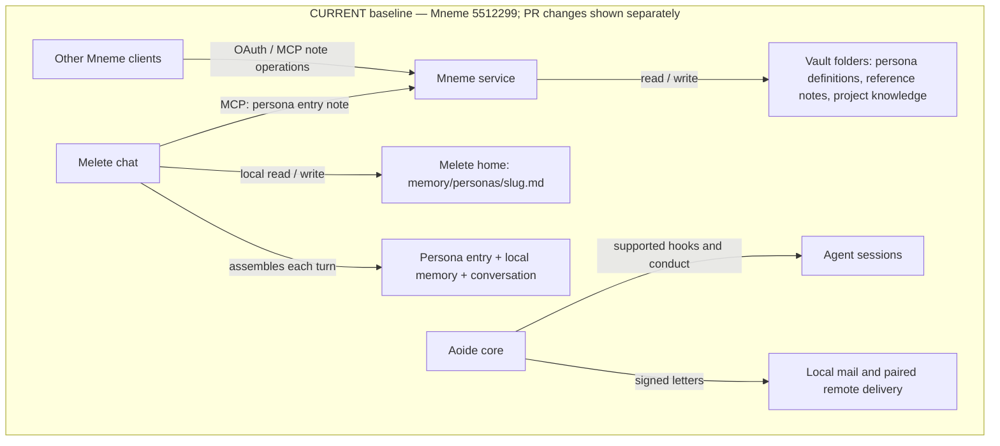
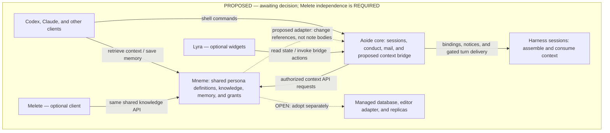
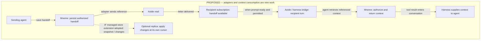

# Proposal: shared personas and memory in Mneme, coordinated through Aoide

Draft for discussion, not an approved implementation contract. The proposed
division puts durable knowledge, revisions, retrieval, and replication in Mneme,
and session coordination, node relationships, and notification delivery in Aoide.
The proposal is to make persona definitions, supporting knowledge, and
accumulated memory available to Codex, Claude, Melete, and other clients through
Mneme, with Aoide connecting that knowledge to sessions and handoffs. A persona
already has a vault home; the proposed change is shared access to its memory and
context across clients, including clients that do not run Melete.

| Status used throughout this page | Meaning |
|---|---|
| **CURRENT — source verified** | Behavior found in the named source snapshots; not a claim about deployment. |
| **UPSTREAM PR — reviewed, unmerged** | Code present in the pinned PR revision; separate from the local baseline and a deployed service. |
| **REQUIRED — constraint** | Melete independence, shell access, the Aoide core/Lyra boundary, and shared persona memory/history under Aoide must hold for the integration. |
| **PROPOSED — awaiting decision** | The concrete design being put forward for discussion; not approved or implemented by this document. |
| **OPEN — decision needed** | A choice the proposal does not settle. Diagrams do not silently settle it. |

**Melete independence is a requirement.** Shared personas and memory must be
usable through Mneme and Aoide with Melete absent. Melete is an optional client
with an existing persona implementation, not a required daemon, library,
identity issuer, or source of runtime state for another harness. Mneme's MCP
entry points remain available. Aoide's integration must also be reachable from
a shell without a configured MCP connector or a Lyra desktop.

**Shared persona continuity under Aoide is a requirement.** Sessions bound to the same persona under Aoide share that persona's memories and history through Mneme across harnesses, including Claude and Codex. Individual session and provider conversation identities remain distinguishable so history retains its origin. Sharing is established by the persona binding, not merely by matching display names or roles. The stable binding mechanism, history representation, retrieval into each turn, and retention remain open. This requirement does not imply automatic sharing by clients outside Aoide or access to another persona's records. It is a decided behavior requirement, not a claim that the integration exists.

**What this draft proposes changing**

| Area | CURRENT — source verified | PROPOSED — awaiting decision | OPEN — decision needed |
|---|---|---|---|
| Persona definitions and reference notes | Already in Mneme-served vault folders. Melete loads the persona entry note. | Other clients resolve and use those definitions and selected references through Mneme. | Folder versus named-vault layout; persona metadata versus separate profile records; selection and refresh rules. |
| Accumulated persona memory | Melete persists it under its own home directory and loads it into its chat turns. | Mneme serves and owns the shared memory; Melete becomes a client of that shared memory, as Codex and Claude would be. | How to migrate existing files and maintain client compatibility. Mneme provides the shared memories and history for same-persona Aoide sessions; the binding and history representation remain open. |
| Session integration | Aoide tracks supported harness events and conducts sessions; it does not hydrate Mneme context. | An Aoide adapter binds sessions to permitted context, exposes retrieval and handoffs, and connects notifications to subscribed sessions. | Identity binding, grants, context selection, and harness-specific turn delivery. |
| Storage and replication | Mneme serves files; external sync or Git moves them. | A separate managed-store extension adds transactional revisions and snapshot/change replication. | Whether and when to adopt the database extension, which vaults migrate, and the editor contract. It is not required for the initial shared-context integration. |
| Lyra surfaces | Existing widgets display Aoide session state. | Widgets can display persona bindings, handoff availability, and context freshness obtained from an Aoide bridge. | Which fields and interactions belong in the widgets. Memory access remains available without them. |

The proposed authority rule is **one authoritative record, many clients and
replicas**. It applies to records placed under Mneme's management. It does not
mean every project file, song, or repository wiki is moved into one database.
For the managed-store extension, clients submit edits to the authority and
replicas follow its committed history. File-backed sharing can be evaluated
before that extension exists.

**Current operation versus proposed operation**

The current-operation column describes reviewed source snapshots: Mneme
`5512299`, Melete `7619d40939f7e6cf4307b32d7e2928e27a0dff23`, and the local Aoide
development revision `8df8e600c21975c5f8f760037286ce78c57cfaca`. It is not a claim
about deployed services or the contents of upstream Aoide `main`.

The baseline table describes those checkouts. The upstream assessment below
separately identifies changes present in an unmerged PR; it does not silently
replace the baseline or claim those changes are deployed.

| Concern                 | CURRENT — Mneme / Melete / Aoide source                                                                                                                                            | PROPOSED — awaiting decision                                                                                                                                                             |
| ----------------------- | --------------------------------------------------------------------------------------------------------------------------------------------------------------------------------- | --------------------------------------------------------------------------------------------------------------------------------------------------------------------------- |
| Knowledge storage       | Mneme reads and writes text files under configured vault roots. There is no central document database.                                                                            | One authoritative Mneme store contains note bodies, memory records, revisions, and a durable change journal.                                                                |
| Multiple vaults         | Already supported through `MNEME_VAULTS`; RPC selects a named vault. Each has its own root and sidecars. `dispatch`, `get_index`, and skills still target the default vault.      | Preserve logical vaults as boundaries for ownership, access, conventions, and replication selection within the shared store; make context retrieval explicitly vault-aware. |
| MCP                     | Two tools, `dispatch` and `RPC`, expose note operations, discovery, recovery, conventions, skills, and semantic queries.                                                          | Keep these entry points. Extend their functions with memory operations, stable identities, revisions, and replication discovery.                                            |
| Conventions and schemas | Mneme serves operating conventions and canonical skill bodies. Most editorial rules depend on the agent following them.                                                           | Ordinary notes retain lightweight conventions. Memory records get the fields and lifecycle checks necessary for reliable reuse.                                             |
| Retrieval               | Text search and optional section embeddings already exist; semantic queries are scoped to one vault.                                                                              | Select authorized vaults, filter memory state and scope, then retrieve relevant context with source revisions.                                                              |
| Personas                | Melete reads persona definitions from Mneme-served vault notes, including folder-form personas with sibling reference files. It loads only the entry note and re-fetches it each turn. | Account for these existing definitions in the shared context model; their relationship to agent identity, skills, and memory ownership remains a decision. |
| Agent memory            | Mneme can store memories as ordinary notes. Melete already persists and loads persona-specific memory from its own local memory directory, alongside shared recall. | Provide shared memory access independent of Melete, with the lifecycle and provenance needed by its clients. Migration and compatibility with existing persona memory remain to be specified. |
| Sync                    | Passive mode delegates to external file sync. Git mode pulls on reads and commits/pushes after writes, favoring local conflicting changes during push recovery.                   | Replicas consume committed revisions and deletions from the authority. Conflicting edits return a conflict instead of silently choosing a winner.                           |
| Concurrent editing      | Some Mneme edit tools validate hashes or matching text; whole-note updates have no expected revision. Melete persona writes accept an optional content-hash token and return conflicts; omission permits unconditional writes. Its lock is process-local. | Every managed write checks its base revision and commits content, revision, and change entry together. This is stronger than either current implementation. |
| Recovery                | External version snapshots are enabled by default outside Git mode; snapshot failures do not block overwrites. Trash is configurable. Raw filesystem edits bypass these handlers. | Managed changes have transactional revision history. Replica deletion and recovery follow explicit changes in the same journal.                                             |
| Access                  | OAuth guards the server. Vault arguments select data; the handler layer has no per-agent vault grant model.                                                                       | Mneme authorizes vault reads, writes, and replication independently of Aoide pairing and mailbox names.                                                                     |
| Aoide integration       | A Mneme service launcher exists. Aoide's content commands are stubs; session hooks and mesh pairing/reporting exist.                                                              | An adapter connects session context, Mneme references, and change notifications without owning a second wiki.                                                               |
| Messaging               | Aoide has conduct, a signed local mailbase, and P-M2 source for directly paired remote deposit and an outbox. That source does not establish deployment, hub transit, or idle-agent doorbells. | Carry knowledge references over available mail transport. Mneme replication remains recoverable without notifications; starting an agent turn is a separate integration. |

Ground truth: [Mneme architecture](https://github.com/noah427/mneme/blob/551229919fac07724de029dfbb7325b29dddbc16/wiki/architecture.md),
[RPC registry](https://github.com/noah427/mneme/blob/551229919fac07724de029dfbb7325b29dddbc16/src/rpc.rs), [write handler](https://github.com/noah427/mneme/blob/551229919fac07724de029dfbb7325b29dddbc16/src/main.rs),
[sync implementation](https://github.com/noah427/mneme/blob/551229919fac07724de029dfbb7325b29dddbc16/src/sync.rs), [convention store](https://github.com/noah427/mneme/blob/551229919fac07724de029dfbb7325b29dddbc16/src/conventions.rs),
and [authentication configuration](https://github.com/noah427/mneme/blob/551229919fac07724de029dfbb7325b29dddbc16/src/auth.rs).
Aoide evidence: launcher (`modules/dendrites/mneme.nix`),
content stubs (`pkgs/aoide/crates/cli/src/commands/stubs.rs`),
session hooks (`pkgs/aoide/crates/conduct/src/commands/hooks.rs`),
mesh implementation (`pkgs/aoide/crates/client/src/mesh.rs`),
local mail implementation (`pkgs/aoide/crates/storage/src/mail.rs`), and remote
mail delivery (`pkgs/aoide/crates/client/src/mail_wire.rs`).
Melete evidence in the local `/home/khoa/melete` checkout at the revision above:
`src/chat.rs` (`PERSONA_FOLDER`, `resolve_persona`, `fetch_persona_note`,
`gather_persona_memory`), `src/persona_memory.rs` (`PersonaMemory::write`,
`slug_for`, `area_locks`), and `src/rune_scope.rs` (`memory_op` persona operations).

**Chart 1 — CURRENT baseline: the split between vault and local memory.**
Arrows name access paths. There is no shared-memory bridge between the two stores.
Deployment packaging for the Mneme service is omitted.



**Upstream response — file-backed capabilities, not the full shared-memory design**

[Mneme PR #49](https://github.com/noah427/mneme/pull/49) is reviewed at
`99a5aa9ed6c6dba16a0cc3cf5de6247ab38fbf1c` against base `5512299`. It is open
and unmerged at this review. Its description identifies the work as a response
to the earlier proposal review. It does not establish agreement on this draft's
later persona-memory transfer, identity model, Melete independence contract, or
Aoide adapter. Those remain evaluated against the requirements of this draft.

| Earlier gap | UPSTREAM PR — behavior present at the reviewed head | Effect on this proposal and remaining boundary |
|---|---|---|
| Rejected pushes could resolve conflicts in favor of local content through `git pull --no-edit -X ours`. | Rejected-push recovery fetches and compares histories. Strictly behind fast-forwards and retries; divergence returns `[sync-conflict]`; other cases retry once. | Removes that local-favoring recovery path. The divergence error occurs after the local write/commit, not before mutation. This does not introduce a single write authority or replace the separate read-time pull path. |
| Whole-note updates lack a revision precondition. | `update_note`, `append_to_note`, and `replace_section` accept optional `expected_head`; `get_vault_revision` exposes the current Git HEAD. | Supplies a limited client preflight check for those three operations. It is a vault-wide commit token, not a per-note revision, a transaction, or an idempotency key. Omitted/blank means unconditional; unavailable Git history produces `[stale-check-unavailable]` when a token is supplied. |
| Index and skill retrieval are default-vault-only; conventions use a shared store. | RPC `get_index`, `get_conventions`, `read_convention`, and `skill_body` accept a named `vault`, with per-vault index, convention, and skill configuration. | Provides concrete retrieval functions for the proposed context adapter. Vault selection still does not authenticate an agent or grant access. Cross-vault ranking and memory lifecycle remain separate work. |
| Other entry points cannot select the same vault context. | Natural-language `dispatch` and MCP resources `convention:///` and `skill:///` remain default-vault-only. Dispatch also supplies no expected-HEAD precondition to its write handlers. | A client using explicit RPC can access the new behavior; existing resource/dispatch consumers do not gain it automatically. Melete's existing persona calls still omit the vault argument. |
| Knowledge changes need attribution and replayable publication. | The post-write sync signature accepts attribution for commit messages, but the inspected handlers pass `None`. The PR description schedules a replayable audit log as later work; it is absent at this head. | A signature accepting attribution is not authenticated caller attribution. No replayable change feed, notification outbox, or replica cursor contract is established by this PR. |
| Shared personas must work independently of Melete. | Changes are inside Mneme; there is no Melete runtime dependency introduced and no persona-memory migration in the diff. | The requirement remains compatible with this work. Making Melete-local memories available to other clients, binding sessions, and delivering idle-agent context remain proposed integration work. |

Implementation evidence: [write handlers and revision check](https://github.com/noah427/mneme/blob/99a5aa9ed6c6dba16a0cc3cf5de6247ab38fbf1c/src/main.rs),
[Git synchronization](https://github.com/noah427/mneme/blob/99a5aa9ed6c6dba16a0cc3cf5de6247ab38fbf1c/src/sync.rs),
and [RPC contract](https://github.com/noah427/mneme/blob/99a5aa9ed6c6dba16a0cc3cf5de6247ab38fbf1c/wiki/tools.md).

The inspected expected-HEAD check and subsequent file write are separate
operations without a shared transaction spanning the check, write, and commit.
Uncommitted edits do not move HEAD, while commits affecting an unrelated note do.
The PR therefore cannot establish the proposed guarantee that every competing
write is revision-checked atomically. These are source-level limits, not a
runtime concurrency test result.

The sync result also has a narrower meaning than remote durability. Non-conflict
Git failures can remain warnings. The rejected-push helper does not return the
retry's success separately, so its caller can log a failure warning even after
a successful retry. Neither a generic success nor that warning is an adequate
standalone statement that another machine has applied the change.

**Chart 1b — UPSTREAM PR #49: explicit RPC and write outcomes, not deployed behavior.**
The first branch happens before mutation; the sync branch happens afterward.
This chart does not depict a transactional shared store.

```text
UPSTREAM PR #49 @ 99a5aa9 — OPEN / UNMERGED / SOURCE REVIEW ONLY

Explicit RPC + vault name
  +--> index / conventions / skill body from that vault
  +--> get_vault_revision --> Git HEAD for a client precondition

update_note / append_to_note / replace_section
  |
  +-- expected_head omitted or blank ----------> unconditional write path
  |
  +-- expected_head supplied
        +-- no usable Git HEAD ----------------> stale-check-unavailable; no write
        +-- HEAD differs ----------------------> stale-write; no write
        +-- HEAD matches ----------------------> proceed to file write
                                                   |
                              [check and write are NOT one transaction]
                                                   |
                                  configured post-write sync
                                    +-- passive --> external sync owns propagation
                                    +-- Git ----> commit / attempt push
                                                   +-- diverged --> sync-conflict
                                                   |                local change remains
                                                   +-- other failures may be warnings

Default-only entry points remain: dispatch, convention:///, skill:///.
No persona-memory transfer, per-agent grants, audit replay, or replicas here.
```

**Chart 2 — PROPOSED: shared knowledge with Melete as an optional client.**
Every edge names the interaction being proposed. A client accesses Mneme's API
directly or through Aoide's shell bridge; it does not need to pass through
Melete. This chart does not require the database or replica extension. PR #49 supplies
some RPC retrieval and write-check primitives shown in Chart 1b; shared memory,
grants, and session integration in this chart remain proposed work.



**Proposed responsibility transfer:** shared accumulated memory currently kept
in Melete would become Mneme-managed data. Melete's conversation engine, tool
execution, and prompt assembly remain client responsibilities. Existing persona
definitions are already vault data and do not require that transfer. Migrating
memory files and changing their callers are proposed work, not actions this
document performs.

**Existing persona homes and memory**

Personas already have a home in the vault. Melete recognizes either
`wiki/personalities/<name>.md` or `wiki/personalities/<name>/index.md`. The folder
form can hold sibling reference material. This is a folder within a served
vault; it does not automatically register a separate Mneme vault or establish
an access boundary. Mneme independently supports named vault roots through
`MNEME_VAULTS`.

| CURRENT component | CURRENT location and behavior | Boundary relevant to the proposed shared use |
|---|---|---|
| Persona definition | A vault note with frontmatter and a Markdown body; Melete inserts the body as a character/voice prefix. | Persona selection does not change harness or tool grants. A persona is not currently an authenticated agent identity. |
| Persona references | Siblings of a folder persona's `index.md`. | Melete reads only the entry note for this purpose and does not follow its wikilinks. Having reference files does not establish that a turn loaded them. |
| Persona memory | `<melete_home>/memory/personas/<slug>.md`, loaded when a persona resolves. | This is local Melete state, not currently served by Mneme's persona-note fetch. Another Mneme client does not automatically receive it. |
| Project knowledge | Vault notes under `wiki/projects/`. | The persona-memory design already separates project facts from a character's accumulated relationship memory. |
| Session binding | Melete stores the selected persona in session metadata. | The memory key comes from the resolved note's `name`, falling back to the pin string; sessions resolving to the same key share the local file. |

The existing read path fetches a persona through `cfg.vault.mcp_url` and calls
`read_note` without a `vault` argument, selecting Mneme's default vault. Naming
additional vaults in Mneme does not by itself make Melete's persona picker or
loader select them. PR #49 extends additional explicit RPC functions with a
vault selector but does not change these Melete calls or automatically select
a persona-specific vault for them.

Memory operations already include `persona_read`, `persona_write`,
`persona_append`, and `persona_list` behind Melete's `memory_op` primitive.
Conditional writes return the current body and version on conflict; the caller
can also omit the version for an unconditional overwrite. Appends read and
write under a process-local lock. These mechanisms do not establish a
cross-process transaction or distributed write authority. File size signals
prompt consolidation; prompt assembly separately caps the memory excerpt.

The memory filename is derived from a lossy slug of the name or path. Renaming
the identity-bearing name can select a different file; distinct names can map
to the same slug. Recording the original key in frontmatter makes that mapping
inspectable, but is not a stable-ID or uniqueness guarantee.

**Persona decisions that remain open**

These questions describe what a decision changes. They do not select an answer.

| Decision                                                                           | Existing behavior and consequence to account for                                                                                                                                                                                                                                  |
| ---------------------------------------------------------------------------------- | --------------------------------------------------------------------------------------------------------------------------------------------------------------------------------------------------------------------------------------------------------------------------------- |
| How is the shared persona identity bound to sessions? | Same-persona sessions under Aoide share memories and history across harnesses. The stable identifier, authenticated binding, rename behavior, and history representation remain open; separate session IDs retain provenance. |
| How does existing persona memory migrate to Mneme? | Mneme provides the shared memories and history for same-persona sessions under Aoide. Definitions are already in vaults; Melete accumulated memory is local. Import, client compatibility, and the treatment of existing local copies remain open. Melete is optional. |
| Does each persona have a folder, a named vault, or references into several vaults? | Folder organization, vault selection, and client authorization are separate mechanisms. The choice affects discovery, grants, replication selection, and handling identical names in different collections.                                                                       |
| How does a turn select supporting knowledge?                                       | Current persona loading reads one note, while siblings remain outside that path. Automatic expansion, explicit retrieval, and a bounded context package have different context costs and freshness behavior.                                                                      |
| When do persona or skill edits affect an active session?                           | Melete re-fetches persona text every turn. The revision-pinned context model below instead assumes explicit refresh or a new session. That is a behavior change for existing clients, not an already shared convention.                                                           |
| Which metadata belongs in a persona definition versus an agent profile?            | Existing definitions describe voice; the proposed profile also names responsibilities, skills, and knowledge. Whether these are fields on existing notes or separate referenced records determines compatibility and which edits can change task context.                         |
| What remains canonical in Git?                                                     | Aoide repository documentation and song design notes accompany code changes in Git. Migrating their bodies into a writable database changes that review workflow; indexing them with source revisions has different ownership semantics. This draft does not itself migrate them. |

**Proposed knowledge model — awaiting decision**

| Proposed concept | Meaning in this draft | Illustrative example | Proposed management rule |
|---|---|---|---|
| Agent memory management | A lifecycle and retrieval service over records. | A session handoff, a verified constraint, a learned preference. | Capture with provenance; distinguish observations from maintained facts; supersede outdated records; exclude expired records from normal retrieval. |
| Agent vault | A logical collection for a persistent agent identity, or an explicitly shared team collection. | Rook's handoffs and working observations across different harnesses and machines. | Same-persona sessions under Aoide share memories and history. Project and access boundaries remain explicit; matching role names alone does not establish the same persona. |
| Regular notes vault | Human-facing documents and project knowledge. | Personal notes, project wikis, architecture decisions, research. | Edit, organize, link, search, version, and sync. No automatic memory expiry applies to ordinary notes. |

These are different axes: a vault is a container; memory management is behavior.
An agent can edit a project wiki without making the wiki an agent-memory vault.
A shared project decision belongs to that project's notes; an agent's memory
links to it rather than copying its body into a private knowledge base.

**Chart 3 — PROPOSED logical relationships; storage paths and vault layout are OPEN.**
This is a reference map, not a replacement directory tree for existing personas.

```text
REQUIRED — same-persona memory and history sharing under Aoide
REQUIRED — shared memories and history through Mneme
PROPOSED — the integration mechanism

Claude session --+
                +--> Aoide binding to the same persona
Codex session --+      +--> Persona definition     existing vault note
                      +--> Shared memories
                      +--> Shared history         source session retained
                      +--> Selected knowledge     project/reference notes

OPEN: stable binding, history representation, retention, and turn retrieval.
OPEN: a scope may use folders, named vaults, or references across vaults.
No directory move or new profile registry is implied by this chart.
```

In the proposed lifecycle model, a memory record starts with a stable ID, body,
kind, project/owner scope,
source reference and revision, recorded time, and lifecycle state. Supersession
links retain why an earlier record stopped being current. Expiry applies to
temporary handoffs where useful. Agent-authored assertions remain attributed;
repetition or a high embedding score does not validate a claim.

**Chart 4 — PROPOSED memory lifecycle; validation is an agent/editor action.**

```text
PROPOSED — not implemented by Mneme's ordinary note storage

Agent observation --> attributed memory --> checked against source
                                               |
                                               v
                                    maintained project note
                                               |
                                               v
                               memory points to canonical note

New evidence --> supersede old memory --> future retrieval uses current state
```

Under this proposal, Mneme would enforce storage and lifecycle rules. The agent performs semantic work;
this proposal does not add an LLM provider inside the server. Existing conventions
and skills remain the shared instructions that agents explicitly load.

**Different agents, different knowledge and capabilities**

The proposed context model holds multiple agent identities. Each has a profile
naming its purpose, selected skills, and knowledge collections; each session
gets a task-specific selection from those records. Here, "profile" describes
information, not a settled new directory or registry. Its representation and
relationship to existing persona notes remain the decisions above. Central
storage does not make every agent's memories visible to every other agent.

| Proposed part   | Proposed durable representation in Mneme                                                                         | Runtime owner and proposed selection                                                                                                                                   |
| --------------- | ------------------------------------------------------------------------------------------------------- | ------------------------------------------------------------------------------------------------------------------------------------------------------------- |
| Identity        | A stable `agent_id` with a versioned profile.                                                           | Aoide or the client binds a session to an authorized identity; a mailbox name or a supplied string alone does not grant that identity.                        |
| Function / role | Purpose, responsibilities, and references to maintained role instructions.                              | Aoide assigns the task; the harness executes it. Several agents can use the same role while keeping distinct identities.                                      |
| Callable tools  | Profile references to required capabilities.                                                            | The harness and Aoide resolve available tools and enforce actual grants. Storing a tool name in Mneme cannot confer permission or install its implementation. |
| Skills          | Canonical versioned skill documents, referenced by each profile.                                        | The adapter loads only the selected, compatible skills; executable dependencies and credentials stay with the runtime.                                        |
| Knowledge       | Shared project documents, agent-authored observations, and maintained domain collections.               | Retrieval follows explicit collection grants, project scope, and the current task.                                                                            |
| Personal memory | Persona memories and history with source-session provenance. | Aoide sessions bound to the same persona share these across harnesses; unrelated personas do not gain access from a matching role name. |
| Session context | Shared history references and checkpoints; the history representation remains open. | Live execution and provider conversation state remain session-specific. Shared history must be accessible across same-persona Aoide sessions; how much enters each prompt is a separate retrieval decision. |

The table describes information and relationships, not required replacements
for `wiki/personalities/` or `wiki/projects/`. In this proposed model, a session ID identifies one run;
an agent ID identifies the continuing agent; a role describes its job; a harness
describes how it runs. Reusing a role or changing the model does not merge agent
identities. Under Aoide, sessions explicitly bound to the same persona share memories
and history across harnesses, including newly created provider conversations. A
separate session ID does not create a separate persona memory collection.

A builder can record an implementation hypothesis while the reviewer records a
contradicting observation. Both retain author and source provenance. Neither
observation overwrites the maintained project decision. A validated finding
updates that decision through the normal revision-checked write; each agent can
then reference the same resulting record. Derived summaries retain source
revisions so later edits can invalidate them.

**Chart 5 — PROPOSED context selection, including the revision-pinning assumption.**
This describes the candidate adapter, not the current Melete loader. PR #49
provides explicit vault selection for index, convention, and skill RPCs; the
authenticated bindings, grants, memory filtering, and revision-pinned context
package in this chart remain proposed.

```text
PROPOSED — context-selection and refresh decisions remain OPEN

Authenticated session bound to agent identity
  --> permitted collections
  --> chosen agent profile and compatible skill revisions
  --> project/task filters and current memory state
  --> relevant excerpts within the harness's context budget
  --> context package with source IDs, revisions, and record types
```

In this proposed flow, access checks happen before search and ranking. Retrieved observations stay
labelled as data; they cannot replace the profile or activate a skill. Profile
and skill changes require the corresponding write permission. A session would
record which profile and skill revisions it loaded; this draft assumes later
changes take effect at explicit refresh or the next session. Adopting that
assumption would change Melete's current per-turn persona refresh behavior;
it remains an open decision.

Sharing consists of granting access to an existing record or publishing a
validated result into an agreed shared collection. A handoff names the task,
selected references, and unresolved work; it does not copy the sender's entire
memory into the recipient's vault. Independent review starts from the assigned
brief and approved evidence, without automatically inheriting the builder's
private session context.

Replication follows the collections authorized for a machine. It does not
automatically load every replicated record into every local agent's context.
Mneme's API grants enforce this separation for clients; mutually untrusted
processes also need separate OS identities, since direct access to the same
database or credential files bypasses an API boundary.

**Proposed managed-store extension — separate from initial integration**

Centralization can start today by pointing clients at one file-backed Mneme
instance. Shared persona access does not require a database conversion. This
draft separately proposes a database-backed transactional record model and
replication; whether to adopt that extension remains open. PR #49 provides
file-backed conflict reporting and optional Git-HEAD checks without introducing
this database. Those changes reduce the earlier gaps but do not implement this
extension's transactional revisions, idempotency, journal, or replica protocol.

For the managed store, the proposed first implementation is SQLite on the
authority's local disk, accessed only through Mneme. It keeps the existing
single-service deployment small. SQLite documents this application-server use
and its serialized writes; high concurrent write demand is a reason to revisit
the engine. [SQLite deployment guidance](https://www.sqlite.org/whentouse.html),
[transaction isolation](https://www.sqlite.org/isolation.html).

**Chart 6 — PROPOSED managed-store extension, only if adopted for a vault.**
This diagram shows the database option, not the prerequisite for Chart 2.
Nothing in PR #49 implements the database, editor adapter, or replicas shown.

```text
PROPOSED EXTENSION — database, editor adapter, replicas; NOT CURRENT

Agent on A -- MCP -----------------------------+
Agent on B -- MCP -----------------------------+
Human editor -- Mneme editor adapter ----------+
                                              v
                                   Authoritative Mneme
                                   +---------------------+
                                   | Canonical database  |
                                   | notes + memories    |
                                   | revisions + changes |
                                   +---------------------+
                                              |
                               authorized snapshot + changes
                                  /                       \
                                 v                         v
                        Replica on A                Replica on B
                        local read API              local read API
                        Markdown view               Markdown view
                        derived search index        derived search index

Replica write requests ------------------> Authoritative Mneme
```

- **One writer authority for the initial shared store.** Multiple clients submit writes; the authority orders commits. There is no automatic replica promotion during a partition.
- **Stable identity.** A note's ID survives a rename or move. Replicas retain the same vault and note IDs; paths are presentation and lookup aliases.
- **Revision checks.** A write supplies the revision it read and an operation ID. The authority rejects a stale base; a repeated operation returns its recorded result without applying twice.
- **Atomic changes.** A transaction saves the new content, its revision, and a sequenced change entry together. Rename/backlink updates belong to one logical change.
- **Catch-up.** A replica starts from an authorized snapshot at a known cursor, then applies later changes in order. It advances its cursor only with the corresponding local commit. An expired cursor requires a fresh snapshot.
- **Deletions.** Tombstones propagate deletion. Retaining them through the supported replay window prevents an old replica from resurrecting a deleted note.
- **Selective replication.** Each node receives explicitly granted vaults. Discovery of a node or membership in a mesh does not grant access to personal notes.
- **Derived copies.** Embeddings, search indexes, and exported Markdown can be rebuilt. Replica application updates or removes affected index entries; old semantic handles are not portable record IDs.
- **Freshness.** Replica reads expose their applied cursor and last successful synchronization. A read requiring a just-committed revision waits for it or uses the authority.
- **Offline default.** Replicas serve their last committed state while disconnected. Writes require the authority; autonomous offline editing and conflict merging remain an open requirement.

SQLite's transaction guarantees cover the local database, not replication between
machines. The extension would require Mneme to implement the snapshot/change protocol; a live `.db` file is not
distributed through ordinary folder sync.

**Editor behavior if the managed-store extension is adopted**

In this proposed extension, the managed database stores canonical note bodies as Markdown/text and preserves
Canvas content. Files on machines are materialized views for existing editors.
An editor adapter submits edits with the note ID and base revision, then refreshes
the view after a successful commit. Conflicts preserve the unsent edit for review.
Creates, renames, deletes, and restores need the same adapter contract; absence
from a partially exported folder is not itself an instruction to delete a note.

**Chart 7 — PROPOSED editor path for a migrated vault only.**

```text
PROPOSED EXTENSION — requires a revision-aware editor adapter

Editor buffer --> adapter + base revision --> Mneme commit --> refreshed file view
```

A watcher alone cannot promise conflict-safe editing: it must know which revision
produced the edited file and distinguish its own exports from user changes.
The editor adapter is part of the database migration's acceptance criteria.
Until it exists, the existing file-backed mode remains the usable notes workflow.

Importing a vault into managed storage establishes the database as its authority.
The original folder becomes an archive or a managed view; it does not continue as
an independently writable master. Existing folder-backed deployments remain
supported. Registration-in-place and physical consolidation are different things:
serving several existing roots gives one API, but does not yet give one database.

**Chaining memory to Aoide**

**Chart 8 — PROPOSED handoff, with optional replication on its own branch.**
The recipient may fetch from Mneme directly; it does not wait for a replica.
The turn-delivery bridge is new work, not a capability supplied by storing a note.
PR #49 does not implement the change-notice adapter or the replayable journal
needed for automatic crash-recoverable publication. Explicit handoff letters
remain distinct from that automatic publication path.



The Aoide session-to-context adapter is new work. Melete already assembles a
persona and local memory into its own chat turns; Aoide hooks do not provide
that behavior to Codex or Claude sessions. Startup exposes a retrieval entry
point; it does not inject a complete memory archive into a fresh conversation.
Explicit checkpoints save important handoffs during work, since a session-end
hook can be missed.

The integration has three independently observable events: a notification is
delivered, a replica applies knowledge changes, and a harness supplies retrieved
context to an agent turn. Their acknowledgements and cursors are not
interchangeable. An idle-agent doorbell supplies the missing turn opportunity;
neither a stored memory nor a deposited letter creates that turn by itself.

In the proposed integration, Mneme serves knowledge independently. Aoide supplies its shell-accessible
coordination and context bridge. Codex, Claude, Melete, and other clients consume
those interfaces; none requires Melete to run. Lyra can render session bindings,
handoff availability, and context freshness from a named bridge. Retrieval,
memory writes, identity binding, and wake-up policy remain usable without QML.
Codex prompt, response, and subagent tracking still depend on its Aoide harness
adapter; storing persona knowledge does not implement event capture.

The proposed notice adapter would put references and change cursors in Aoide
letters. This example is a proposed payload, not an implemented Mneme event:
`{kind: "mneme.changed", vault_id: "projects", through_seq: 1842}`.
Mneme serves the authoritative content after checking access. Mailing complete
wikis would create another retained copy in the mailbase and, eventually, transit
hubs. The inspected mail design explicitly treats mail as readable data at rest.

In the managed-store extension, the proposed durable change journal also acts
as the notification outbox: the adapter
retries committed entries after a crash. Recipients tolerate duplicate notices;
periodic cursor reconciliation catches missed notices. The replayable audit log
mentioned as future PR #49 work is not yet this journal: its eventual event
contents, cursor semantics, and relationship to committed writes need evidence
before it can satisfy this contract. This is the
[transactional outbox pattern](https://docs.aws.amazon.com/prescriptive-guidance/latest/cloud-design-patterns/transactional-outbox.html).
Aoide's mail outbox handles transport delivery; the proposed Mneme journal records
which knowledge changes exist. These stores have different responsibilities.

A mail delivery acknowledgement means the notice arrived. It does not mean a
replica applied the revision or an agent incorporated it into context. Mail
remains data that agents pull; intentional tasking continues through Aoide's
conduct path and its existing gate.

Aoide pairing supplies node identity and connectivity. Mneme keeps its own
vault authorization, including reads, search results, history, and replication.
Mapping a verified Aoide node to a Mneme grant is an explicit integration step;
an arbitrary session ID or mailbox name is attribution, not authentication.
Existing source admission policy in Aoide applies when connecting new content.

**Conditional replacement scope — awaiting the corresponding decisions**

| Proposed change, if adopted | What it could retire or avoid | What that does not remove |
|---|---|---|
| Move shared persona memory into Mneme | Melete's local files as the authoritative store for migrated shared memories, after client cutover and verification. | Melete itself, its conversations, prompt assembly, or unrelated local state. No existing memory is deleted by this proposal. |
| Adopt PR #49 file-backed primitives | The rejected-push `-X ours` fallback and default-only limitations of the four named RPC functions. | Melete-local persona memory, default-only dispatch/resources, or the need for explicit identity, grants, and context integration. |
| Use Mneme for shared knowledge retrieval | A separate Aoide wiki database, embedding engine, or duplicate index for the same records. Aoide content commands are currently stubs, so much of this is avoided future implementation. | Aoide's content admission policy, session graph, conduct, mailbase, and audit log. |
| Adopt managed storage and replication for a vault | That vault's external folder-sync authority and file-backed history path once migrated. | File-backed support for unmigrated vaults, or sync for attachments outside this draft's scope. Supporting both modes may initially increase code. |
| Reference repository-owned documents from context | Duplicate maintained summaries of the same source facts. | Git-owned architecture documents, song definitions, widget files, design notes, drafts, or takes. Their ownership is not transferred by a diagram. |

**Proposed work and dependencies — not a single mandatory build sequence**

| Proposed work | What it requires | What it does not require | Evidence that it works |
|---|---|---|---|
| Shared persona context and memory | Implement the required same-persona memory/history sharing under Aoide; decide stable bindings, history representation, and migration; implement grants and the client/Aoide adapter contract; account for existing persona notes and memory. PR #49 offers explicit vault-aware retrieval primitives if adopted/deployed, but not the grants or shared-memory service. | Melete running, a database migration, replicas, or Lyra. | With Melete absent, two clients load authorized persona context and exchange a handoff. Shared/separate memory behavior matches the chosen bindings across sessions; persona metadata cannot widen tool grants. |
| Managed authority extension | A separate storage decision (not settled by PR #49), stable record IDs, transactional revisions, journal, import/export, and an editor adapter for a pilot vault. | Replica deployment or Aoide remote mail. | Stale edits cannot silently overwrite newer ones; a committed change survives a crash with its journal entry; text, links, and Canvas survive import/export. |
| Replica extension | Managed authority's authorized snapshot/change protocol and a reachable Mneme endpoint. | Aoide change notices or an agent turn. | Reconnection converges, including renames and deletions; repeated changes do not duplicate content; unauthorized collections are absent. |
| Aoide handoff/change notices | A reference-producing client or adapter and usable mail transport; remote use also requires compatible paired nodes. | A replica or database for an explicit handoff letter. Automatic crash-recoverable publication of every managed change does require the journal contract. | A delivered letter references retrievable authorized context. With journal-based notices, missed or duplicate notices do not affect replica convergence. |
| Idle-agent context delivery | A subscription, permitted prompt-ready turn delivery, a working conduct/native harness channel, and a retrieval entry point. | Melete, Lyra, or a local replica. | A waiting agent receives a turn opportunity and retrieves the handoff; mail delivery and context consumption are reported separately. |
| Lyra presentation | A shell-accessible bridge exposing the chosen session and context state. | Ownership of memory or a QML-only API. | The widget displays bridge state; the same capability remains accessible after removing the widget. |

The five original architecture questions mailed by Claude concern widget source
ownership, reload results, socket checks, review protocol, and runtime-directory
ownership. The three later questions concern remote-text rendering, release
dependencies for reader hardening, and audit outcome semantics. They remain
separate decisions: this proposal does not settle them. Runtime-channel health
affects idle-agent delivery; mail rendering and audit decisions affect the
transport used by notices. Neither the persona model nor a Mneme database
resolves those questions by itself.

**Open decisions and review limits**

- Offline editing: this draft assumes offline reads and connected commits; accepting disconnected writes adds durable pending edits and a conflict-resolution workflow.
- Availability: replicas improve read availability; automatic write failover needs a separate ownership/consensus design.
- Memory removal: expiry stops routine retrieval; erasure across revisions, replicas, exports, and backups needs an explicit retention policy.
- Scope: the first pilot covers Mneme's current text and Canvas surface; general attachment storage is not specified here.
- Verification: the baseline snapshots and PR #49 at `99a5aa9` were reviewed as source. The PR is open at review and reports `cargo check --tests`; that is compile checking, not evidence of executed behavioral tests. This review did not independently run its checks or verify CI. No live persona vault, running shared-memory service, cross-machine synchronization, or executable tests of this proposal were exercised.
- Documentation drift: older README counts and parts of the roadmaps lag the source; Aoide's mail design describes more than its current implementation.
